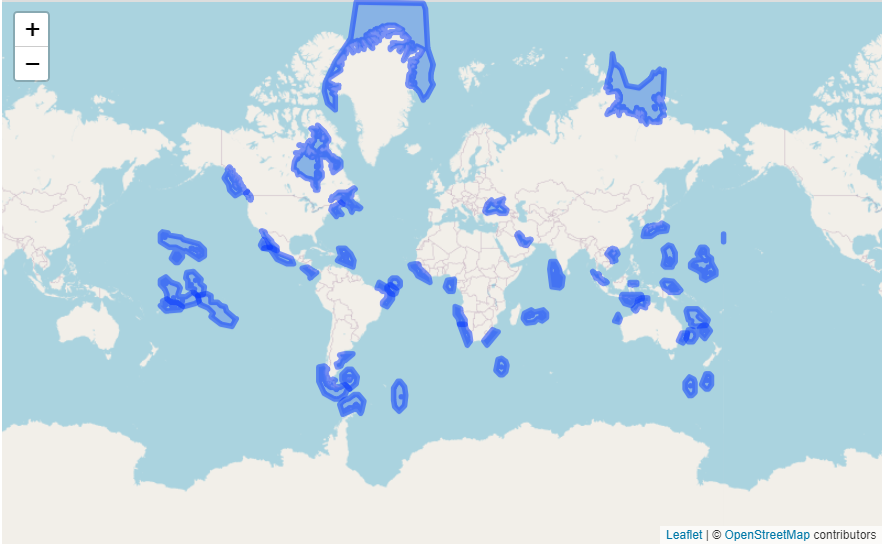
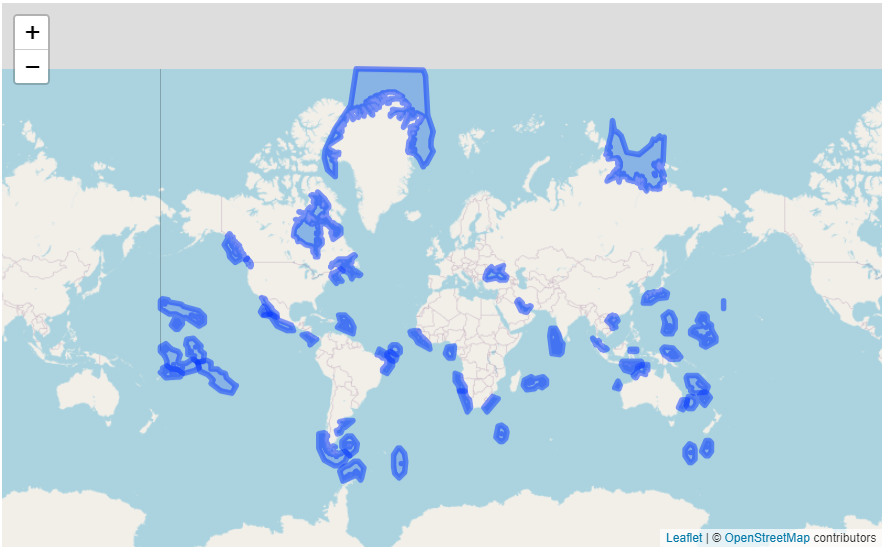
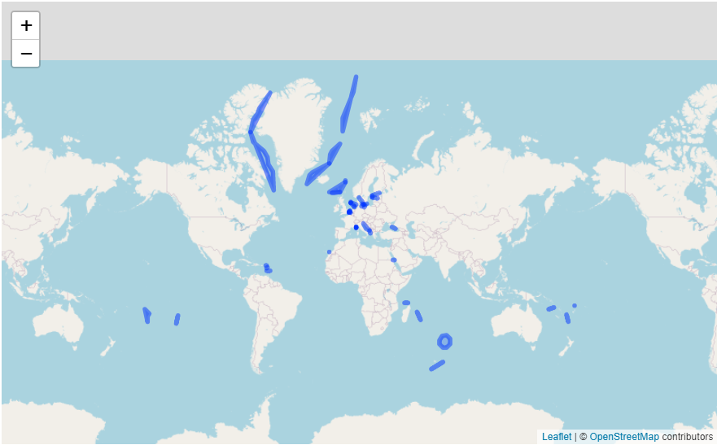

mregions
========


[](https://cranchecks.info/pkgs/mregions)
[](https://travis-ci.org/ropensci/mregions)
[](https://codecov.io/github/ropensci/mregions?branch=master)
[](https://github.com/r-hub/cranlogs.app)
[](https://cran.r-project.org/package=mregions)
[](https://github.com/ropensci/software-review/issues/53)

`mregions` - Get data from <https://www.marineregions.org>

Some data comes from the [Flanders Marine Institute (VLIZ) geoserver](http://geo.vliz.be/geoserver/web/)

`mregions` is useful to a wide diversity of R users because you get access to all of the
data MarineRegions has, which can help in a variety of use cases:

* Visualize marine regions alone
* Visualize marine regions with associated data paired with analysis
* Use marine region geospatial boundaries to query data providers (e.g., OBIS (<https://www.obis.org>))
* Geocode - get geolocation data from place names
* Reverse Geocode - get place names from geolocation data

## Install

```{r eval=FALSE}
install.packages("mregions")
install.packages("sf")
```

Development version

```{r eval=FALSE}
devtools::install_github("ropensci/mregions")
```

```{r}
library("mregions")
library("sf")

# helper library
library("leaflet")
```


## GeoJSON

### Marine Ecoregions of the World (MEOW)

Get Data

```{r, eval=FALSE}
ecoregions_geoJSON <- mr_geojson(key = "Ecoregions:ecoregions")
# check number of features
length(ecoregions_geoJSON$features)
```

Plot Data

```{r eval=FALSE}
leaflet() %>%
  addProviderTiles(provider = 'OpenStreetMap') %>%
  addGeoJSON(geojson = ecoregions_geoJSON$features) %>%
  fitBounds(-160,-52,160,60)
```



### Maritime Boundaries (EEZ)

Get Data

```{r}
eezboundaries_geoJSON <- mr_geojson(key = "MarineRegions:eez_boundaries")
```

Plot Data

```{r eval=FALSE}
leaflet() %>%
  addProviderTiles(provider = 'OpenStreetMap') %>%
  addGeoJSON(geojson = eezboundaries_geoJSON$features) %>%
  fitBounds(-160,-52,160,60)
```


## Shape

### Marine Ecoregions of the World (MEOW)

Get region

```{r}
ecoregions_shp <- mr_shp(key = "Ecoregions:ecoregions", maxFeatures = 50)
# check class
class(ecoregions_shp)
```

Plot data

```{r eval=FALSE}
leaflet() %>%
  addProviderTiles(provider = 'OpenStreetMap') %>%
  addPolygons(data = ecoregions_shp)
```


### Maritime Boundaries (EEZ)

Get region

```{r}
eezboundaries_shp <- mr_shp(key = "MarineRegions:eez_boundaries", maxFeatures = 50)
```

Plot data

```{r eval=FALSE}
leaflet() %>%
  addProviderTiles(provider = 'OpenStreetMap') %>%
  addPolygons(data = eezboundaries_shp)
```



## Convert to WKT

### Marine Ecoregions of the World (MEOW)

From GeoJSON

```{r eval=FALSE}
ecoregions_geoJSON <- mr_geojson(key = "Ecoregions:ecoregions")
ecoregions_wkt1 <- mr_as_wkt(ecoregions_geoJSON, fmt = 2)
# check class
class(ecoregions_wkt1) # character
```

From shp object (using the sf package)


```{r eval=FALSE}
ecoregions_shp <- mr_shp(key = "Ecoregions:ecoregions", maxFeatures = 50)
ecoregions_shp_geom <- sf::st_geometry(ecoregions_shp)
ecoregions_wkt2 <- sf::st_as_text(ecoregions_shp_geom)
```
More detailed example using the Black Sea Ecoregion only

```{r, eval=FALSE}
# subset Black Sea Ecoregion
ecoregions_blacksea <- subset(ecoregions_shp, ecoregions_shp$ecoregion == "Black Sea")
## check class
class(ecoregions_blacksea) # sf
# extract geometry
ecoregions_blacksea_geom <- sf::st_geometry(ecoregions_blacksea) 
## check class
class(ecoregions_blacksea_geom) # sfc
# convert to wkt from sfc
ecoregions_blacksea_wkt2 <- sf::st_as_text(ecoregions_blacksea_geom)
## check class
class(ecoregions_blacksea_wkt2) # character
```

## Gazetteer Record by Name

### High Seas

```{r, results='hide'}
highseas_info <- mr_geo_code(place = "High Seas")
# check class
class(highseas_info) # data.frame
```

### Marine Ecoregions of the World (MEOW)

```{r, results='hide'}
ecoregions_info <- mr_geo_code(place = "Ecoregions")
# check class
class(ecoregions_info) # data.frame
```

## Contributors

* [Scott Chamberlain](https://github.com/sckott)
* [Francois Michonneau](https://github.com/fmichonneau)
* [Pieter Provoost](https://github.com/pieterprovoost)
* [Michael Sumner](https://github.com/mdsumner)
* [Lennert Schepers](https://github.com/LennertSchepers)
* [Salvador Fernandez](https://github.com/salvafern)

## Meta

* Please [report any issues or bugs](https://github.com/ropensci/mregions/issues).
* License: MIT
* Get citation information for `mregions` in R doing `citation(package = 'mregions')`
* Please note that this project is released with a [Contributor Code of Conduct](https://github.com/ropensci/mregions/blob/master/CONDUCT.md). By participating in this project you agree to abide by its terms.

[](https://ropensci.org)
