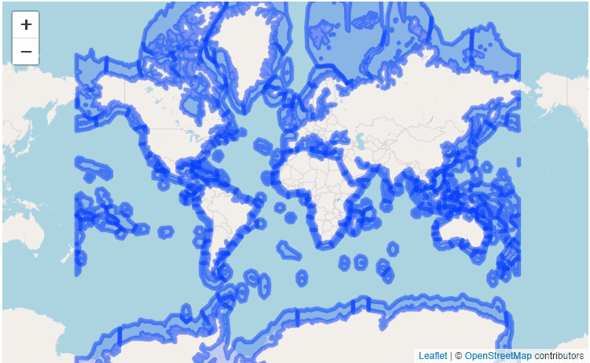
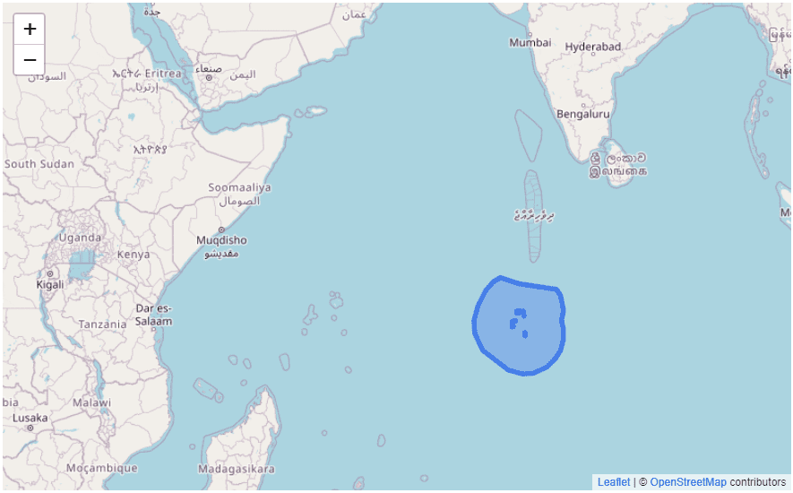

mregions
========

```{r setup, include=FALSE} 
knitr::opts_chunk$set(
  warning = FALSE, 
  message = FALSE,
  collapse = TRUE,
  comment = "#>"
) 
```

[](https://cran.r-project.org/web/checks/check_results_mregions.html)
[](https://travis-ci.org/ropensci/mregions)
[](https://codecov.io/github/ropensci/mregions?branch=master)
[](https://github.com/r-hub/cranlogs.app)
[](https://cran.r-project.org/package=mregions)
[](https://github.com/ropensci/software-review/issues/53)

`mregions` - Get data from <https://www.marineregions.org>

Some data comes from the [Flanders Marine Institute (VLIZ) geoserver](http://geo.vliz.be/geoserver/web/)

`mregions` is useful to a wide diversity of R users because you get access to all of the
data MarineRegions has, which can help in a variety of use cases:

* Visualize marine regions alone
* Visualize marine regions with associated data paired with analysis
* Use marine region geospatial boundaries to query data providers (e.g., OBIS (<https://www.obis.org>))
* Geocode - get geolocation data from place names
* Reverse Geocode - get place names from geolocation data

## Install

```{r eval=FALSE}
install.packages("mregions")
install.packages("sf")
```

Development version

```{r eval=FALSE}
devtools::install_github("ropensci/mregions")
```

Load Libraries

```{r}
library("mregions")
library("sf")

# helper library
library("leaflet")
```


## Get GeoJSON

#### example 1: Marine Ecoregions of the World (MEOW)

**Get Data**

Keys accessible from the [Flanders Marine Institute (VLIZ) geoserver](http://geo.vliz.be/geoserver/web/).

```{r, eval=TRUE}
ecoregions_geoJSON <- mr_geojson(key = "Ecoregions:ecoregions", maxFeatures = 250)
length(ecoregions_geoJSON$features)
```

**Plot Data**


```{r eval=FALSE}
leaflet() %>%
  addProviderTiles(provider = 'OpenStreetMap') %>%
  addGeoJSON(geojson = ecoregions_geoJSON$features) %>%
  fitBounds(-160,-52,160,60)
```



### example 2: Maritime Boundaries (EEZ)

**Get Data**

```{r}
eezboundaries_geoJSON <- mr_geojson(key = "MarineRegions:eez", maxFeatures = 1)
```

**Plot Data**

```{r eval=FALSE}
leaflet() %>%
  addProviderTiles(provider = 'OpenStreetMap') %>%
  addGeoJSON(geojson = eezboundaries_geoJSON$features) %>%
  fitBounds(39,11,83,-10)
```


## Get Shape

#### example 1: Marine Ecoregions of the World (MEOW)

**Select region**

```{r, eval=TRUE}
ecoregions_shp <- mr_shp(key = "Ecoregions:ecoregions", maxFeatures = 250)
class(ecoregions_shp)
```

**Plot data**

```{r eval=FALSE}
leaflet() %>%
  addProviderTiles(provider = 'OpenStreetMap') %>%
  addPolygons(data = ecoregions_shp)%>%
  fitBounds(-182,-79,178,83)
```


#### example 2: Maritime Boundaries (EEZ)

**Select region**

```{r, eval=FALSE}
eezboundaries_shp <- mr_shp(key = "MarineRegions:eez", maxFeatures = 1)
```

**Plot data**

```{r eval=FALSE}
leaflet() %>%
  addProviderTiles(provider = 'OpenStreetMap') %>%
  addPolygons(data = eezboundaries_shp)
```


## Convert to WKT

#### example 1: Marine Ecoregions of the World (MEOW)

**From GeoJSON**

```{r eval=TRUE}
ecoregions_geoJSON <- mr_geojson(key = "Ecoregions:ecoregions", maxFeatures = 250)
ecoregions_wkt_fromGeoJSON <- mr_as_wkt(ecoregions_geoJSON, fmt = 2)
class(ecoregions_wkt_fromGeoJSON)
ecoregions_wkt_fromGeoJSON[1]
```

**From shp object (using the sf package)**


```{r eval=TRUE}
ecoregions_shp <- mr_shp(key = "Ecoregions:ecoregions", maxFeatures = 250)
ecoregions_shp_geom <- st_geometry(ecoregions_shp)
ecoregions_wkt_fromshp <- st_as_text(ecoregions_shp_geom)
ecoregions_wkt_fromshp[1]
```
*More detailed example using the Black Sea Ecoregion only*

```{r, eval=TRUE}
ecoregions_blacksea <- subset(ecoregions_shp, ecoregions_shp$ecoregion == "Black Sea")
class(ecoregions_blacksea)

ecoregions_blacksea_geom <- st_geometry(ecoregions_blacksea) 
class(ecoregions_blacksea_geom)

ecoregions_blacksea_wkt <- st_as_text(ecoregions_blacksea_geom)
class(ecoregions_blacksea_wkt)
ecoregions_blacksea_wkt
```

## Gazetteer Record by Name

#### example: High Seas

```{r, eval=TRUE}
highseas_info <- mr_geo_code(place = "High Seas")
class(highseas_info)
str(highseas_info)
```


## Contributors

* [Scott Chamberlain](https://github.com/sckott)
* [Francois Michonneau](https://github.com/fmichonneau)
* [Pieter Provoost](https://github.com/pieterprovoost)
* [Michael Sumner](https://github.com/mdsumner)
* [Lennert Schepers](https://github.com/LennertSchepers)
* [Salvador Fernandez](https://github.com/salvafern)

## Meta

* Please [report any issues or bugs](https://github.com/ropensci/mregions/issues).
* License: MIT
* Get citation information for `mregions` in R doing `citation(package = 'mregions')`
* Please note that this project is released with a [Contributor Code of Conduct](https://github.com/ropensci/mregions/blob/master/CONDUCT.md). By participating in this project you agree to abide by its terms.

[](https://ropensci.org)
