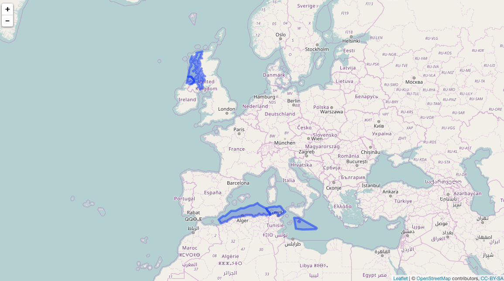
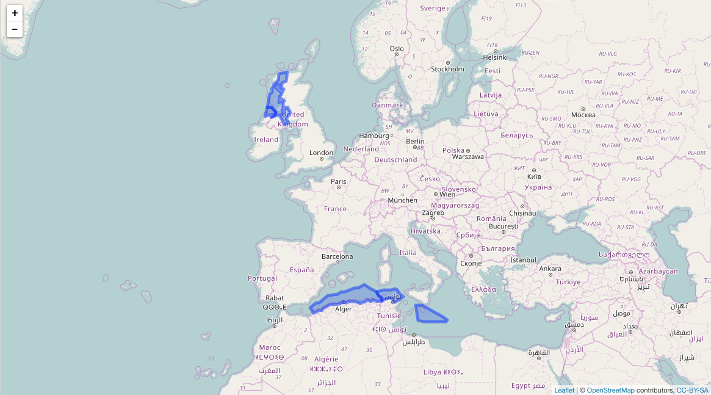

<!--
%\VignetteEngine{knitr::knitr}
%\VignetteIndexEntry{mregions introduction}
%\VignetteEncoding{UTF-8}
-->

```{r echo=FALSE}
knitr::opts_chunk$set(
  comment = "#>",
  collapse = TRUE,
  warning = FALSE,
  message = FALSE
)
```

mregions introduction
=====================

`mregions` is useful to a wide diversity of R users because you get access to all of the
data MarineRegions has, which can help in a variety of use cases:

* Visualize marine regions alone
* Visualize marine regions with associated data paired with analysis
* Use marine region geospatial boundaries to query data providers (e.g., OBIS (<http://www.iobis.org>))
* Geocode - get geolocation data from place names
* Reverse Geocode - get place names from geolocation data

## Install

Stable version

```{r eval=FALSE}
install.packages("mregions")
```

Dev version

```{r eval=FALSE}
devtools::install_github("ropensci/mregions")
install.packages("leaflet")
```

```{r}
library("mregions")
```

## Get list of place types

```{r}
res <- mr_place_types()
head(res$type)
```

## Get Marineregions records by place type

```{r}
res1 <- mr_records_by_type(type = "EEZ")
head(res1)
```

## Get a data.frame of region names

```{r}
rnames <- mr_names("MarineRegions:iho")
```

## Search region names

Either pass output of `mr_names()`

```{r}
mr_names_search(rnames, "IHO")
```

or don't (but then `mr_names_search()` call takes longer)

```{r}
mr_names_search("iho", q = "Sea")
```

## Get a region - geojson

```{r}
res3 <- mr_geojson(key = "Morocco:dam")
class(res3)
names(res3)
```

## Get a region - shp

```{r}
res4 <- mr_shp(key = "Morocco:dam")
class(res4)
```


## Convert to WKT

From geojson or shp. Here, geojson

```{r eval=FALSE}
res7 <- mr_geojson(key = "Morocco:dam")
mr_as_wkt(res7, fmt = 5)
#> [1] "MULTIPOLYGON (((41.573732 -1.659444, 45.891882 ... cutoff
```

## Dealing with bigger WKT

What if you're WKT string is super long?  It's often a problem because some online species occurrence databases that accept WKT to search by geometry bork due to
limitations on length of URLs if your WKT string is too long (about 8000 characters,
including remainder of URL). One way to deal with it is to reduce detail - simplify.

```{r eval=FALSE}
install.packages("rmapshaper")
```

Using `rmapshaper` we can simplify a spatial object, then search with that.

```{r}
shp <- mr_shp(key = "MarineRegions:eez_iho_union_v2", maxFeatures = 5)
```

Visualize

```{r eval=FALSE}
library(leaflet)
leaflet() %>%
  addTiles() %>%
  addPolygons(data = shp)
```



Simplify

```{r}
library("rmapshaper")
shp <- ms_simplify(shp)
```

It's simplified:

```{r eval=FALSE}
library(leaflet)
leaflet() %>%
  addTiles() %>%
  addPolygons(data = shp)
```



[mr]: https://github.com/ropensci/mregions
